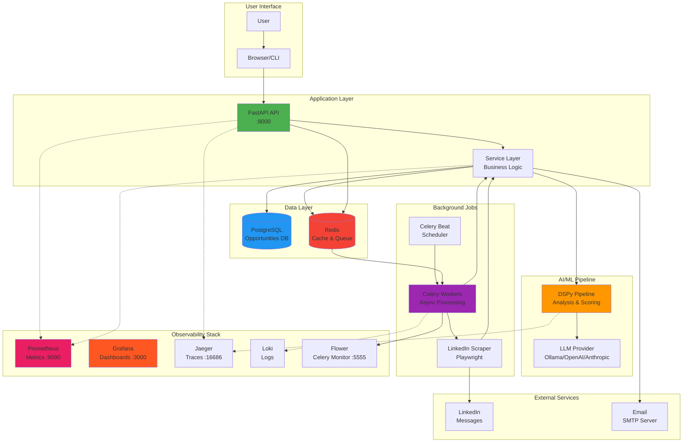
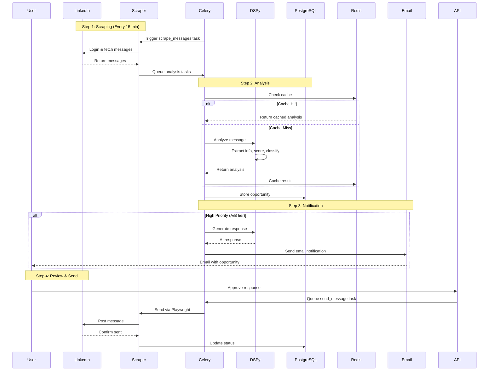
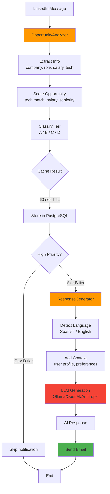
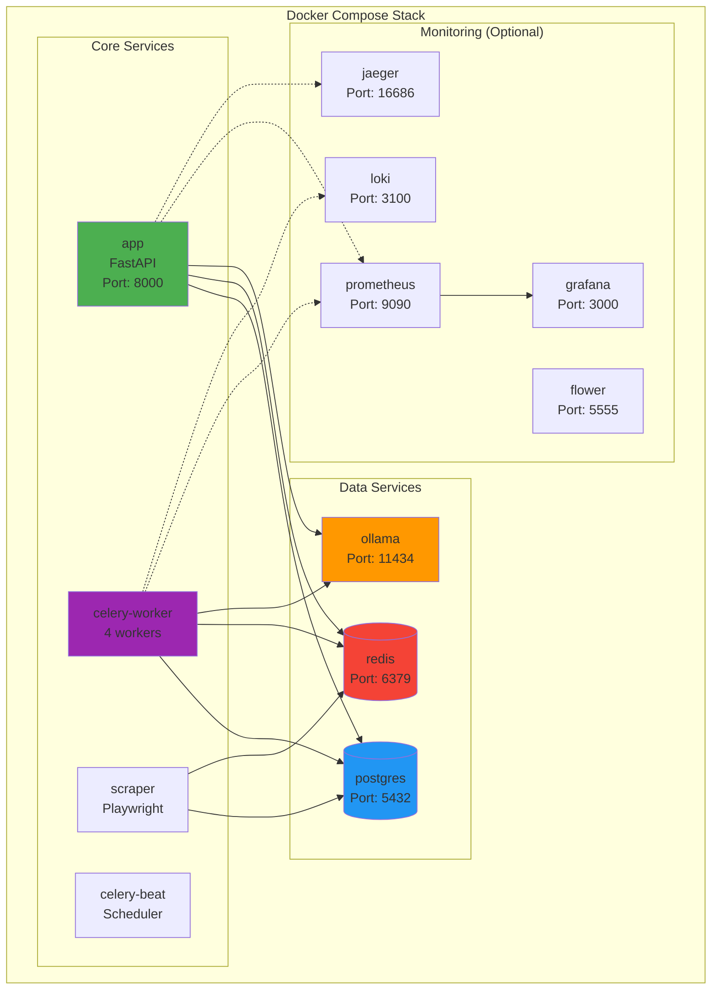
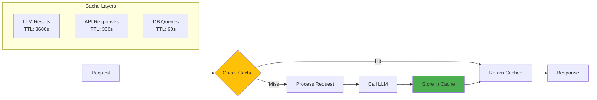
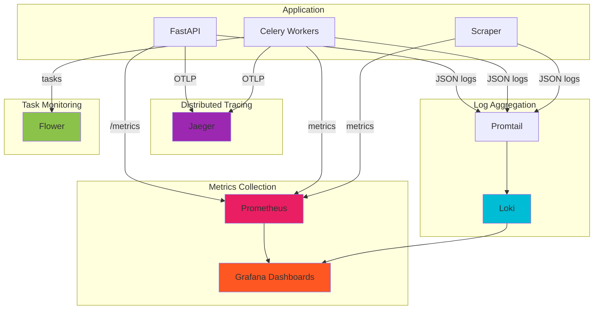
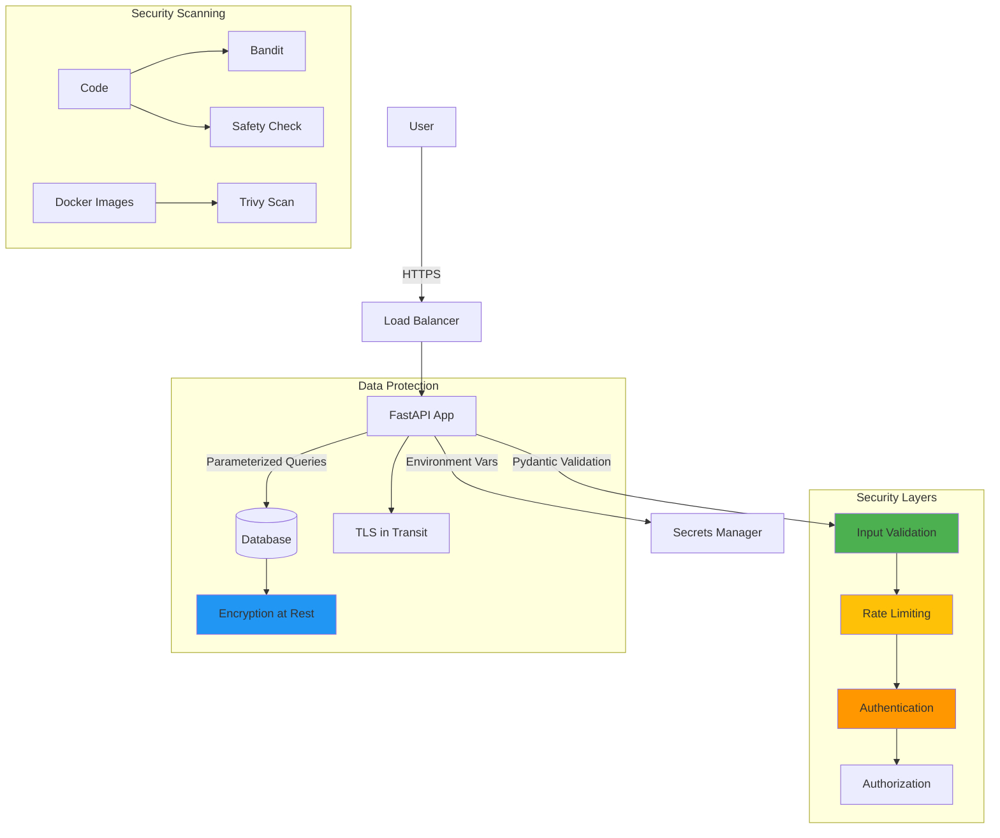
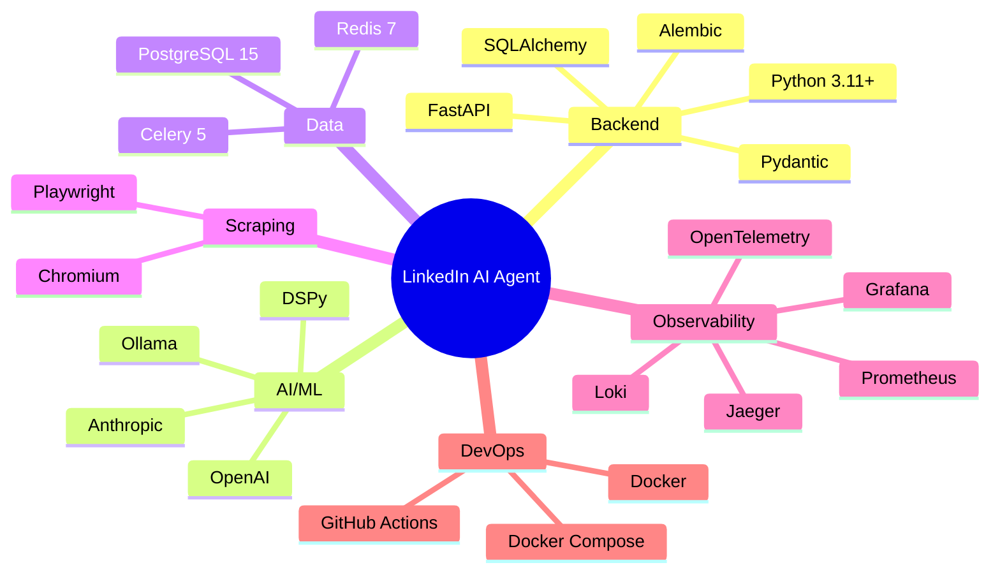
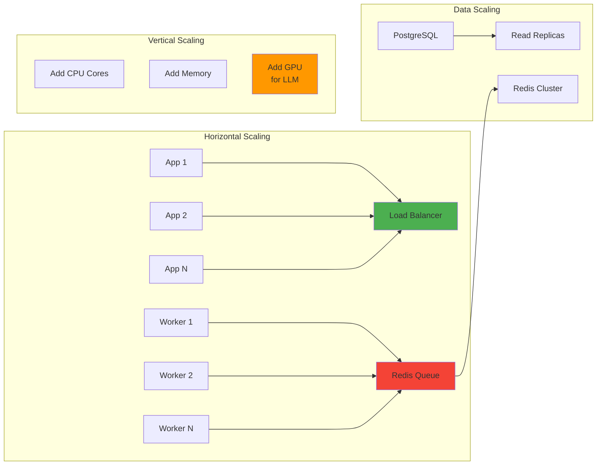

# LinkedIn AI Agent - Architecture Diagrams

## System Architecture Overview



## Data Flow Diagram



## Component Architecture

```mermaid
graph LR
    subgraph "API Layer"
        R1[/opportunities]
        R2[/responses]
        R3[/health]
        R4[/metrics]
    end

    subgraph "Service Layer"
        OS[OpportunityService]
        RS[ResponseService]
    end

    subgraph "Repository Layer"
        OR[OpportunityRepo]
        RR[ResponseRepo]
    end

    subgraph "Domain Models"
        OM[Opportunity]
        RM[Response]
        AM[Analysis]
    end

    R1 --> OS
    R2 --> RS
    OS --> OR
    RS --> RR
    OR --> OM
    RR --> RM
    OS --> AM

    style OS fill:#4CAF50
    style RS fill:#4CAF50
    style OR fill:#2196F3
    style RR fill:#2196F3
```

## DSPy Pipeline Flow



## Deployment Architecture



## Caching Strategy



## Observability Stack



## Security Architecture



---

## Technology Stack Visualization



---

## Performance Characteristics

| Component | Latency (p95) | Throughput | Notes |
|-----------|---------------|------------|-------|
| **API (no LLM)** | < 100ms | 100+ req/s | With caching |
| **DSPy Pipeline** | 2-4s | 15 msg/min | Single worker |
| **Cache Hit** | < 10ms | 1000+ req/s | Redis lookup |
| **Database Query** | < 10ms | 500+ qps | With indexes |
| **LLM Call (Ollama)** | 1-3s | 20+ req/min | Local inference |
| **LLM Call (OpenAI)** | 0.5-2s | 60+ req/min | API limits |

---

## Scaling Strategy



---

## Next Steps

To create a more visual diagram:

1. **Using draw.io** (recommended):
   - Go to https://app.diagrams.net/
   - Import `ARCHITECTURE_DIAGRAM.md`
   - Export as PNG/SVG
   - Save to `docs/images/architecture.png`

2. **Using Excalidraw**:
   - Go to https://excalidraw.com/
   - Draw architecture manually
   - Export as PNG
   - Save to `docs/images/architecture-simple.png`

3. **Using Mermaid Live Editor**:
   - Go to https://mermaid.live/
   - Copy diagrams from above
   - Export as PNG/SVG
   - Save to `docs/images/`
