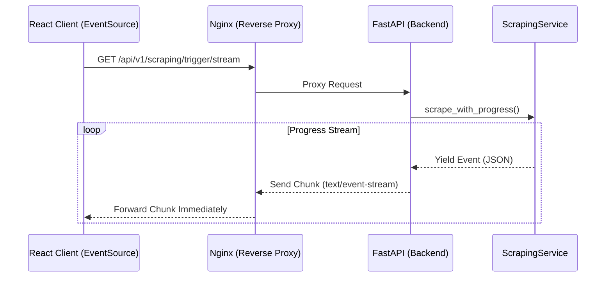

# Comprehensive Guide to Server-Sent Events (SSE)

**Target Audience:** Engineering Team
**Updated:** February 2026
**Context:** Nexton Repository Pattern

---

## 1. Introduction

**Server-Sent Events (SSE)** is a standard allowing servers to push real-time updates to clients over a single, long-lived HTTP connection.

### Why SSE?
For our **LinkedIn Scraping** feature, we considered WebSockets but chose SSE for these reasons:
*   **Simplicity**: It uses standard HTTP, making it firewall-friendly and easier to debug.
*   **Unidirectional**: We only need to send status updates *to* the client (Client -> triggers scraping; Server -> streams progress).
*   **Automatic Reconnection**: The browser's `EventSource` API handles connection drops automatically.

### Architecture in Nexton


---

## 2. Backend Implementation (FastAPI)

We use **FastAPI's `StreamingResponse`** to yield data chunks without closing the connection.

### The Problem: Blocking the Event Loop
Standard synchronous scraping block the main thread. If we run `time.sleep(10)` or a heavy LangChain/DSPy call, **no events will be sent** until it finishes.

**The Solution:**
We use a **Threadpool + Queue Bridge** pattern:
1.  Run the blocking task in a thread (`run_in_threadpool`).
2.  Pass a callback to the blocking task.
3.  The callback puts updates into an `asyncio.Queue` using `loop.call_soon_threadsafe`.
4.  The async generator yields from the queue.

### Code Pattern
Reference: `app/services/scraping_service.py`

```python
# The Blocking Service
def blocking_task(on_progress):
    # Do heavy work...
    on_progress("step_1", {"status": "done"})

# The Async Bridge
async def event_generator():
    queue = asyncio.Queue()
    loop = asyncio.get_running_loop()

    def callback(step, data):
        loop.call_soon_threadsafe(queue.put_nowait, (step, data))

    # Run in thread
    task = asyncio.create_task(
        run_in_threadpool(blocking_task, on_progress=callback)
    )

    while not task.done() or not queue.empty():
        # Yield events as they arrive
        event = await queue.get()
        yield event
```

### Robust Serialization (Crucial Fix)
When yielding JSON data, **always** use this pattern to avoid crashes with `datetime` objects or Docker/Go encoding issues:

```python
import json

# Good: Handles datetime and special characters
yield f"data: {json.dumps(event, ensure_ascii=False, default=str)}\n\n"
```

---

## 3. Frontend Implementation (React)

We use the native `EventSource` API to consume the stream.

### Component Logic
Reference: `frontend/src/components/dashboard/ScrapingProgress.tsx`

```tsx
useEffect(() => {
    // 1. Open Connection
    const eventSource = new EventSource("/api/v1/scraping/trigger/stream");

    // 2. Handle Named Events
    eventSource.addEventListener("progress", (e) => {
        const data = JSON.parse(e.data);
        setEvents((prev) => [...prev, data]);
    });

    eventSource.addEventListener("completed", () => {
        eventSource.close(); // Clean up
    });

    // 3. Handle Errors
    eventSource.onerror = (err) => {
        console.error("Stream failed", err);
        eventSource.close();
    };

    // 4. Cleanup on Unmount
    return () => {
        eventSource.close();
    };
}, []);
```

---

## 4. Infrastructure (Nginx)

This is the most common point of failure. **Nginx buffers responses** by default. It waits until it has a certain amount of data (e.g., 4KB) before sending it to the client.

For SSE, this is disastrous: the client receives nothing for 30 seconds, then gets *all* events at once.

### Configuration Fix
Reference: `frontend/nginx.conf`

**You MUST disable buffering for SSE endpoints:**

```nginx
location /api {
    # Standard Proxy Setup
    proxy_pass http://app:8000;
    proxy_http_version 1.1;
    proxy_set_header Connection '';

    # CRITICAL: Disable Buffering
    proxy_buffering off;
    proxy_cache off;

    # Optional: Aggressive timeouts for long streams
    proxy_read_timeout 300;
}
```

---

## 5. Best Practices Checklist (2026)

| Category | Practice | Why? |
| :--- | :--- | :--- |
| **Serialization** | `ensure_ascii=False` | Logs and non-browser clients (like Go/Docker) can crash on escaped Unicode (`\u00e9`). Raw UTF-8 is safer. |
| **Serialization** | `default=str` | Prevents `TypeError: Object of type datetime is not JSON serializable`. |
| **Sanitization** | `unidecode` | If user input (names, bios) contains obscure control characters, it can break the stream. Sanitize inputs. |
| **Network** | **Heartbeats** | Send a comment line (`: ping\n\n`) every 15s if no data is sent. Load balancers (AWS ALB, Cloudflare) kill idle connections after 60s. |
| **UX** | **Granular Updates** | Don't just say "Loading...". Break it down: "Login", "Scraping", "Analyzing". Users tolerate wait times 3x longer if they see progress. |
| **Nginx** | **X-Accel-Buffering** | You can also set `X-Accel-Buffering: no` header in FastAPI response to instruct Nginx to disable buffering per-request. |

## Quick Troubleshooting

1.  **"I see no events, then all at once!"** -> Check Nginx `proxy_buffering off;`.
2.  **"Stream disconnects after 60s"** -> Add Heartbeats (pings) or check Load Balancer timeout.
3.  **"502 Bad Gateway"** -> Backend crashed. Check logs for serialization errors (`TypeError`).
4.  **"Invalid Character in Docker logs"** -> Set `ensure_ascii=False` in `json.dumps`.
